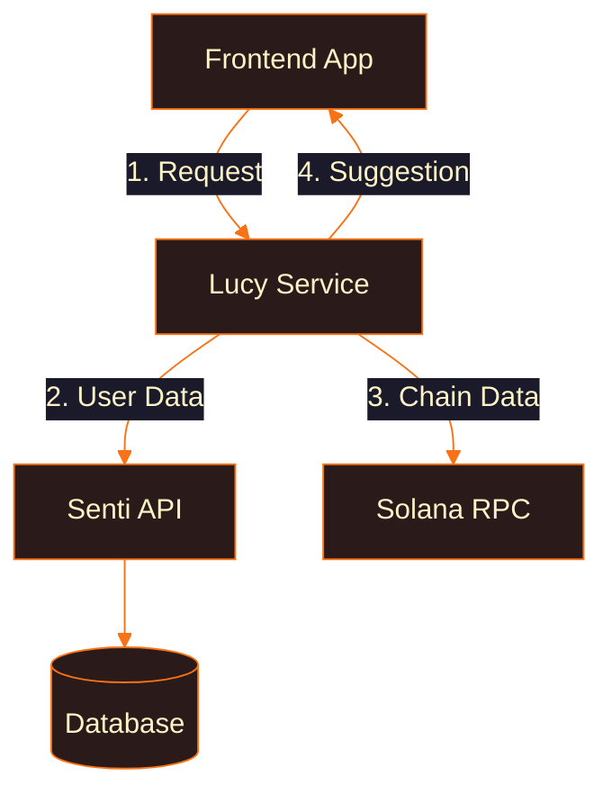
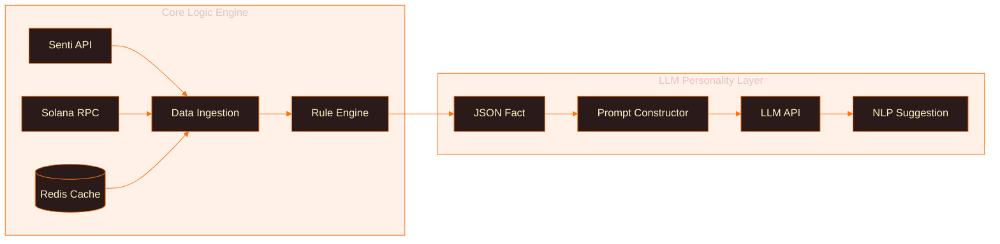

# Lucy AI Service - Yield Optimization Assistant


## Overview

Lucy AI is the intelligent layer for the Senti platform, providing personalized yield optimization suggestions through a hybrid intelligence model that combines deterministic rule-based analysis with generative AI for natural language communication.

### Core Philosophy: Hybrid Intelligence

We combine **deterministic, rules-based logic** for mathematical precision with **generative LLM capabilities** for intuitive communication:

- **🧮 Reliable & Deterministic**: Financial advice based on verifiable math
- **⚡ Performant & Scalable**: Fast, cacheable logic handles core analysis
- **💬 Intuitive & Engaging**: Natural language presentation of complex DeFi concepts

## System Architecture



## Internal Architecture



## Project Structure

```
lucy-ai-service/
├── .env.example             # Environment variables template
├── .gitignore               # Git ignore rules
├── Dockerfile               # Container configuration
├── README.md                # This file
├── docker-compose.yml       # Local development setup
├── requirements.txt         # Python dependencies
│
├── src/                     # Source code
│   └── lucy_ai/
│       ├── __init__.py
│       │
│       ├── api/             # FastAPI endpoints & schemas
│       │   ├── __init__.py
│       │   ├── endpoints.py # API routes
│       │   └── schemas.py   # Pydantic models
│       │
│       ├── core/            # Business logic
│       │   ├── __init__.py
│       │   ├── engine.py    # Rule-based analysis
│       │   └── personality.py # LLM integration
│       │
│       ├── services/        # External service clients
│       │   ├── __init__.py
│       │   ├── senti_backend.py # Senti API client
│       │   └── solana_rpc.py    # Solana RPC client
│       │
│       └── main.py          # FastAPI app entry point
│
└── tests/                   # Test suite
    ├── __init__.py
    └── test_suggestions.py
```

## Quick Start

### Prerequisites

- Python 3.9+
- Redis (optional, for caching)
- LLM API access (OpenAI, Anthropic, etc.)

### Installation

1. **Clone and setup:**
```bash
git clone <repository-url>
cd lucy-ai-service
cp .env.example .env
```

2. **Install dependencies:**
```bash
pip install -r requirements.txt
```

3. **Configure environment:**
```env
SENTI_BACKEND_URL=https://api.senti.com
SOLANA_RPC_URL=https://api.mainnet-beta.solana.com
LLM_API_KEY=your_llm_api_key
REDIS_URL=redis://localhost:6379
```

4. **Run the service:**
```bash
uvicorn src.lucy_ai.main:app --reload --port 8000
```

### Using Docker

```bash
docker-compose up --build
```

## API Usage

### Get Yield Suggestions

```bash
curl -X GET "http://localhost:8000/api/v1/suggestions/user_123" \
  -H "Content-Type: application/json"
```

**Response:**
```json
{
  "suggestion": "It looks like you could be earning an extra 2.5% on your USDC by moving it from Vault A to Vault C! 🚀",
  "fact": {
    "suggestion_type": "MOVE_FUNDS",
    "token": "USDC",
    "from_vault_name": "Vault A",
    "from_vault_apy": 4.0,
    "to_vault_name": "Vault C", 
    "to_vault_apy": 6.5,
    "apy_gain_percent": 2.5
  }
}
```

## How It Works

### 1. Data Ingestion
- Fetches user vault data from Senti Backend API
- Retrieves live APY data from Solana blockchain
- Caches results in Redis for performance

### 2. Core Engine Analysis
```python
# Example rule logic
if user_vault.is_unlocked and best_apy > user_vault.apy:
    suggestion = {
        "type": "MOVE_FUNDS",
        "apy_gain": best_apy - user_vault.apy
    }
```

### 3. LLM Personality Layer
- Takes structured JSON facts
- Generates friendly, actionable suggestions
- Maintains consistent "Lucy" persona

## Development

### Running Tests
```bash
pytest tests/
```

### Code Structure
- **`src/lucy_ai/api/`**: FastAPI routes and request validation
- **`src/lucy_ai/core/`**: Business logic and AI integration  
- **`src/lucy_ai/services/`**: External API clients
- **`tests/`**: Unit and integration tests

### Adding New Suggestion Types
1. Extend rules in `core/engine.py`
2. Update schemas in `api/schemas.py`
3. Add tests in `tests/test_suggestions.py`

## Configuration

### Environment Variables
| Variable | Description | Default |
|----------|-------------|---------|
| `SENTI_BACKEND_URL` | Senti API base URL | Required |
| `SOLANA_RPC_URL` | Solana RPC endpoint | Required |
| `LLM_API_KEY` | LLM provider API key | Required |
| `REDIS_URL` | Redis connection string | `redis://localhost:6379` |
| `CACHE_TTL` | Cache time-to-live (seconds) | `300` |

## Contributing

1. Fork the repository
2. Create a feature branch
3. Add tests for new functionality
4. Submit a pull request

