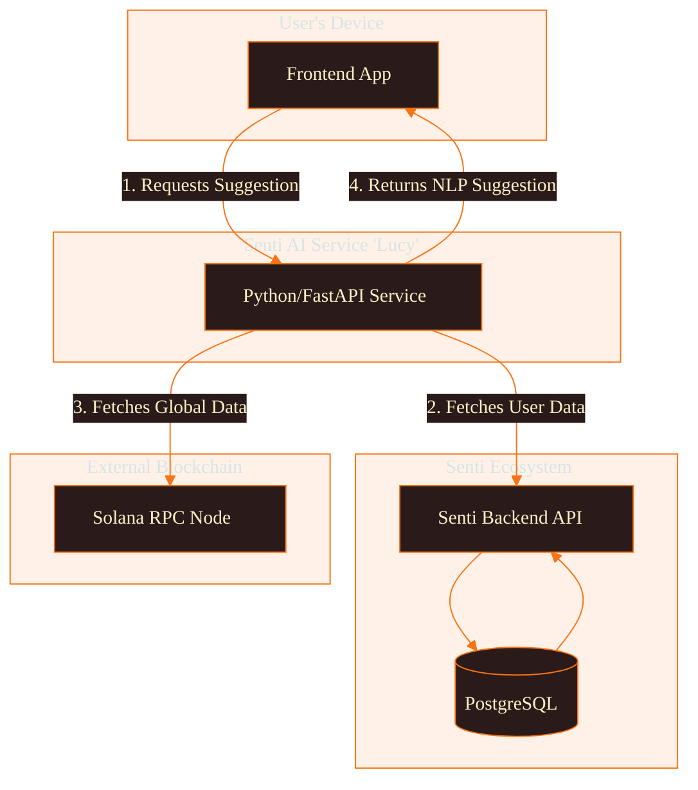
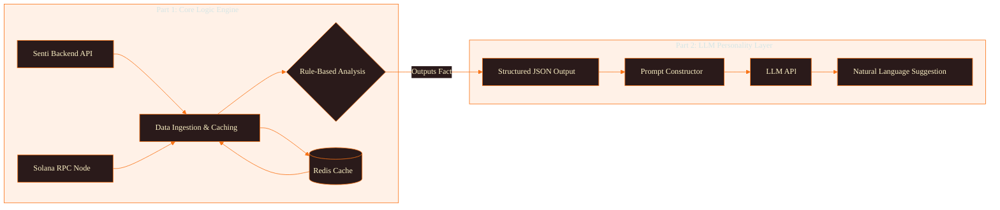

# Senti AI System ("Lucy") - Architecture Documentation

## Overview & Guiding Philosophy

The "Lucy" AI system serves as the intelligence layer for the Senti platform, delivering timely, personalized, and actionable yield optimization suggestions to users.

### Core Philosophy: Hybrid Intelligence Model

We combine a **deterministic, rules-based Core Engine** for mathematical precision with a **generative LLM Personality Layer** for natural communication. This ensures:

- **Reliable & Deterministic**: Financial advice based on verifiable math, not probabilistic guesses
- **Performant & Scalable**: Fast, cacheable logic handles core analysis
- **Intuitive & Engaging**: Natural language presentation of complex DeFi concepts

## System Architecture

"Lucy" operates as a decoupled microservice consumed by the Senti Frontend, gathering data from:

- **Senti Backend API**: User-specific data
- **Solana RPC Node**: Global, on-chain data



## Internal Architecture: Two-Part System

The service is split into two distinct components:



## Step-by-Step Logic & Data Flow

### 1. Request Initiation
- Frontend calls `GET /api/v1/suggestions/{user_id}` on the "Lucy" service

### 2. Data Ingestion & Caching
- Data Ingestion Layer checks Redis for cached data
- On cache miss, makes parallel async calls to:
  - Senti Backend API (user vaults, balances, lockup status)
  - Solana RPC Node (live APYs, vault states)
- Stores fetched data in Redis with short TTL (2-5 minutes)

### 3. Core Engine Analysis
- Logic Engine runs deterministic rules:
  - Check if user vaults are unlocked
  - Compare vault APYs against best available
  - Check reward thresholds for claiming
- Performs required mathematical calculations

### 4. Structured JSON "Fact" Generation
- Engine outputs structured JSON representing analysis outcomes
- Contains verifiable "facts" about optimization opportunities

### 5. LLM Personality Layer
- Prompt Constructor embeds JSON into crafted prompt
- Instructs LLM to act as "Lucy" persona
- Translates structured data into friendly, compelling language

### 6. Final NLP Response
- LLM generates natural language string
- Service returns final API response to frontend

## Example Walkthrough

**Scenario**: User has 500 USDC in "Vault A" (4.0% APY, unlocked). Best USDC vault "Vault C" offers 6.5% APY.

### Data Flow:

1. **Data Ingestion**: Gathers user position + global APY data
2. **Core Engine Analysis**:
   - `is_unlocked("Vault A")` → `True`
   - `best_usdc_apy (6.5) > user_usdc_apy (4.0)` → `True`
   - Calculates: `apy_gain = 6.5 - 4.0 = 2.5`
3. **JSON "Fact" Output**:
```json
{
  "suggestion_type": "MOVE_FUNDS",
  "token": "USDC",
  "from_vault_name": "Vault A",
  "from_vault_apy": 4.0,
  "to_vault_name": "Vault C",
  "to_vault_apy": 6.5,
  "apy_gain_percent": 2.5
}
```
4. **LLM Prompt**:
```
You are 'Lucy,' a friendly and helpful DeFi assistant. 
A user has a potential yield optimization. Convert the 
following data into an encouraging, single-sentence suggestion.

Data: [JSON above]
```
5. **Final Response**:
> "It looks like you could be earning an extra 2.5% on your USDC by moving it from Vault A to Vault C! 🚀"

