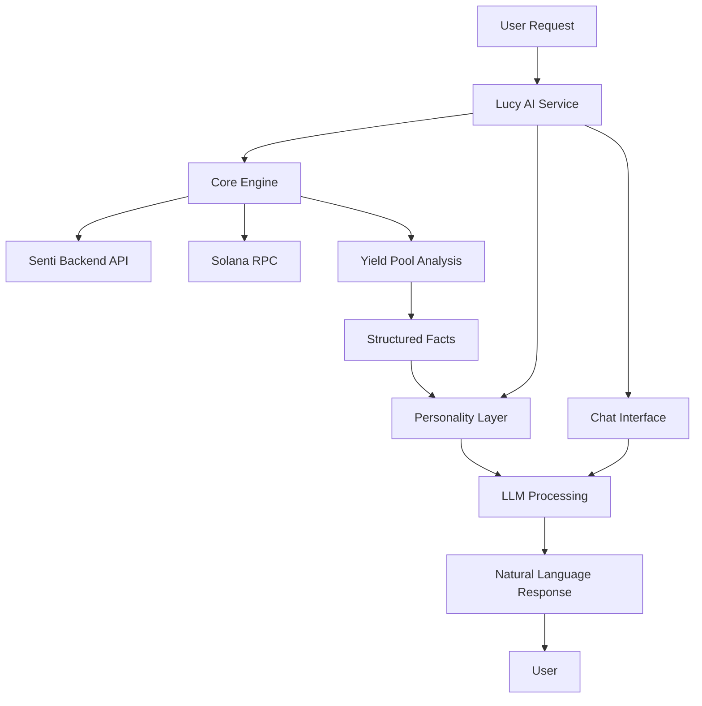

# Lucy AI Service 🧠


> **Lucy** is an intelligent AI service that provides personalized yield optimization suggestions for DeFi users on the Senti platform. Combining deterministic financial analysis with natural language generation, Lucy delivers actionable insights in a friendly, conversational manner.

## 🎯 Overview

Lucy AI Service is a microservice built with FastAPI that serves as the intelligence layer for the Senti DeFi platform. It analyzes user positions, market conditions, and yield opportunities to provide personalized suggestions for optimizing returns on stablecoin investments.

### Key Features

- **🤖 AI-Powered Suggestions**: Natural language yield optimization recommendations
- **💬 Conversational Chat**: Interactive chat interface for DeFi questions and guidance
- **📊 Real-time Analysis**: Live APY comparisons across multiple DeFi protocols
- **🛡️ Risk-Aware**: Built-in risk scoring for safe investment recommendations
- **⚡ High Performance**: Async operations with intelligent caching
- **🔌 Multi-LLM Support**: OpenAI GPT and Google Gemini integration
- **🐳 Containerized**: Ready for production deployment

## 🏗️ Architecture

Lucy follows a **Hybrid Intelligence Model** combining:

1. **Core Logic Engine**: Deterministic, rules-based financial analysis
2. **LLM Personality Layer**: Natural language generation for user-friendly communication



## 🚀 Quick Start

### Prerequisites

- Python 3.11+
- Docker & Docker Compose (optional)
- OpenAI API Key or Google API Key

### Environment Setup

1. **Clone the repository**
   ```bash
   git clone <repository-url>
   cd lucy-ai-service
   ```

2. **Create environment file**
   ```bash
   cp .env.example .env
   ```

3. **Configure environment variables**
   ```bash
   # Required: Choose one LLM provider
   OPENAI_API_KEY=your_openai_api_key_here
   # OR
   GOOGLE_API_KEY=your_google_api_key_here
   
   # Optional: Customize settings
   LLM_MODEL_NAME=gpt-4o-mini
   LLM_MODEL_NAME_GEMINI=gemini-2.5-pro
   MAX_MVP_RISK_SCORE=3
   SENTI_BACKEND_API_URL=http://localhost:3001/api
   SOLANA_RPC_URL=https://api.devnet.solana.com
   ```

### Installation & Running

#### Option 1: Docker (Recommended)

```bash
# Build and run with Docker Compose
docker-compose up --build

# Service will be available at http://localhost:8000
```

#### Option 2: Local Development

```bash
# Install dependencies
pip install -r requirements.txt

# Run the service
python -m uvicorn src.lucy_ai.main:app --host 0.0.0.0 --port 8000 --reload
```

## 📡 API Endpoints

### Base URL
```
http://localhost:8000
```

### Health Check

#### `GET /`
**Description**: Simple health check endpoint to verify service status.

**Response**:
```json
{
  "status": "ok",
  "message": "Lucy AI Service is running!"
}
```

**Example**:
```bash
curl http://localhost:8000/
```

---

### AI Suggestions

#### `GET /api/v1/suggestions/{user_id}`

**Description**: Get personalized AI yield optimization suggestions for a specific user.

**Parameters**:
- `user_id` (path, required): Unique identifier for the user
- `asset` (query, optional): Asset type to analyze. Default: `USDC`
  - Supported values: `USDC`, `USDT`

**Response Model**: `SuggestionResponse`
```json
{
  "suggestion_text": "string"
}
```

**Example Request**:
```bash
curl "http://localhost:8000/api/v1/suggestions/user123?asset=USDC"
```

**Example Response**:
```json
{
  "suggestion_text": "Great news! I found a better yield opportunity for your USDC. You could earn 6.2% APY by moving your funds to Solend on Solana, which is 0.7% higher than your current position. This could mean an extra $70 annually on a $10,000 investment! 🚀"
}
```

**Error Responses**:
- `500 Internal Server Error`: Core engine analysis failed
- `500 Internal Server Error`: NLP suggestion generation failed

---

### Chat Interface

#### `POST /api/v1/chat/{user_id}`

**Description**: Send a conversational message to Lucy AI and receive a natural language response.

**Parameters**:
- `user_id` (path, required): Unique identifier for the user

**Request Body**: `ChatMessage`
```json
{
  "message": "string"
}
```

**Response Model**: `ChatResponse`
```json
{
  "response": "string"
}
```

**Example Request**:
```bash
curl -X POST "http://localhost:8000/api/v1/chat/user123" \
  -H "Content-Type: application/json" \
  -d '{"message": "What are the best yield opportunities for USDC right now?"}'
```

**Example Response**:
```json
{
  "response": "Based on current market conditions, I'd recommend looking at Solend on Solana for USDC, which is currently offering 6.2% APY with a moderate risk profile. This is significantly higher than traditional savings accounts and provides good liquidity. Would you like me to analyze your current positions to see if this would be a good fit for your portfolio?"
}
```

**Error Responses**:
- `500 Internal Server Error`: Failed to generate AI response

---

## 📋 API Schemas

### Request/Response Models

#### `ChatMessage`
```json
{
  "message": "string"
}
```

#### `ChatResponse`
```json
{
  "response": "string"
}
```

#### `SuggestionResponse`
```json
{
  "suggestion_text": "string"
}
```

#### `YieldPool`
```json
{
  "pool_id": "string",
  "protocol_name": "string",
  "asset": "USDC" | "USDT",
  "current_apy": 0.0,
  "risk_score": 1
}
```

#### `SuggestionFact`
```json
{
  "suggestion_type": "BEST_YIELD" | "DEFAULT_SAFE",
  "recommended_pool_id": "string",
  "protocol_name": "string",
  "asset": "USDC" | "USDT",
  "apy": 0.0
}
```

---

## 🔧 Configuration

### Environment Variables

| Variable | Description | Default | Required |
|----------|-------------|---------|----------|
| `OPENAI_API_KEY` | OpenAI API key for GPT models | `your_openai_api_key_here` | Yes* |
| `GOOGLE_API_KEY` | Google API key for Gemini models | - | Yes* |
| `LLM_MODEL_NAME` | OpenAI model to use | `gpt-4o-mini` | No |
| `LLM_MODEL_NAME_GEMINI` | Gemini model to use | `gemini-2.5-pro` | No |
| `MAX_MVP_RISK_SCORE` | Maximum risk score for recommendations | `3` | No |
| `SENTI_BACKEND_API_URL` | Senti backend API endpoint | `http://localhost:3001/api` | No |
| `SOLANA_RPC_URL` | Solana RPC node URL | `https://api.devnet.solana.com` | No |
| `HOST` | Server host | `0.0.0.0` | No |
| `PORT` | Server port | `8080` | No |
| `CORS_ORIGINS` | Allowed CORS origins (comma-separated) | `*` | No |
| `CORS_CREDENTIALS` | Allow credentials in CORS requests | `true` | No |
| `CORS_METHODS` | Allowed HTTP methods (comma-separated) | `*` | No |
| `CORS_HEADERS` | Allowed headers (comma-separated) | `*` | No |

*At least one LLM API key is required (OpenAI or Google)

### Risk Scoring System

Lucy uses a 5-point risk scoring system:
- **1-2**: Low risk (Established protocols like Aave, Compound)
- **3**: Medium risk (Newer but stable protocols)
- **4-5**: High risk (Experimental or new protocols)

By default, Lucy only recommends pools with risk scores ≤ 3.

### CORS Configuration

Lucy includes built-in CORS (Cross-Origin Resource Sharing) support for frontend integration:

#### Development Setup (Allow All Origins)
```bash
# In your .env file
CORS_ORIGINS=*
CORS_CREDENTIALS=true
CORS_METHODS=*
CORS_HEADERS=*
```

#### Production Setup (Specific Origins)
```bash
# In your .env file
CORS_ORIGINS=https://yourdomain.com,https://www.yourdomain.com,http://localhost:3000
CORS_CREDENTIALS=true
CORS_METHODS=GET,POST,PUT,DELETE,OPTIONS
CORS_HEADERS=Content-Type,Authorization,Accept,Origin,X-Requested-With
```

#### Frontend Integration Example

**JavaScript/React:**
```javascript
// Example API call from frontend
const response = await fetch('http://localhost:8000/api/v1/suggestions/user123?asset=USDC', {
  method: 'GET',
  headers: {
    'Content-Type': 'application/json',
  },
});
const data = await response.json();
```

**Chat API Example:**
```javascript
const chatResponse = await fetch('http://localhost:8000/api/v1/chat/user123', {
  method: 'POST',
  headers: {
    'Content-Type': 'application/json',
  },
  body: JSON.stringify({
    message: "What are the best yield opportunities for USDC?"
  }),
});
const chatData = await chatResponse.json();
```

## 🧠 How Lucy Works

### 1. Data Collection
Lucy gathers data from multiple sources:
- **Senti Backend API**: User vault positions, balances, lockup status
- **Solana RPC**: Live APY data, vault states
- **Internal Pool Database**: Pre-configured yield opportunities

### 2. Core Analysis Engine
The deterministic engine performs:
- Risk assessment of available pools
- APY comparison against user's current positions
- Lockup status verification
- Yield optimization calculations

### 3. AI Personality Layer
Lucy's personality layer:
- Converts structured analysis into natural language
- Maintains a friendly, encouraging tone
- Provides context and actionable insights
- Uses emojis and conversational style

### 4. Chat Interface
Lucy's conversational capabilities:
- **Interactive Q&A**: Users can ask questions about DeFi strategies
- **Context-Aware**: Responses consider user's current positions and preferences
- **Educational**: Explains complex DeFi concepts in simple terms
- **Personalized**: Tailored advice based on user's risk tolerance and goals

### Supported Yield Pools

Lucy currently analyzes these DeFi protocols:

| Protocol | Asset | APY Range | Risk Score | Description |
|----------|-------|-----------|------------|-------------|
| Aave V3 (Ethereum) | USDC/USDT | 5.8-6.1% | 2 | Established lending protocol |
| Compound (Ethereum) | USDC/USDT | 5.5-5.9% | 2 | Decentralized lending |
| Solend (Solana) | USDC/USDT | 6.2-6.5% | 3 | Solana-based lending |
| NewDeFi (Arbitrum) | USDC | 7.5% | 4 | Higher yield, higher risk |

## 🛠️ Development

### Project Structure

```
lucy-ai-service/
├── src/
│   └── lucy_ai/
│       ├── api/
│       │   ├── endpoints.py      # API route definitions
│       │   └── schemas.py         # Pydantic models
│       ├── core/
│       │   ├── engine.py         # Core logic engine
│       │   └── personality.py    # LLM personality layer
│       ├── services/
│       │   ├── senti_backend.py  # Senti API integration
│       │   └── solana_rpc.py     # Solana RPC client
│       └── main.py               # FastAPI application
├── tests/
│   └── test_suggestions.py       # Unit tests
├── requirements.txt              # Python dependencies
├── Dockerfile                    # Container configuration
├── docker-compose.yml            # Multi-service setup
└── README.md                     # This file
```

### Adding New Yield Pools

To add new yield opportunities, update the `AVAILABLE_POOLS_MVP` list in `src/lucy_ai/core/engine.py`:

```python
YieldPool(
    pool_id="new_protocol_usdc",
    protocol_name="New Protocol",
    asset="USDC",
    current_apy=8.0,
    risk_score=4
)
```

### Customizing Lucy's Personality

Modify the personality prompts in `src/lucy_ai/core/personality.py`:

```python
LUCY_BASE_PROMPT = """
You are 'Lucy,' a friendly, calm, and informed financial AI co-pilot for the Senti platform. Your goal is to translate structured financial data into a simple, reassuring, and actionable suggestion for the user. Use natural language, avoid jargon. Keep it concise (1-2 sentences).
"""
```

### Adding Chat Functionality

The chat interface uses a separate prompt template for conversational interactions:

```python
CHAT_PROMPT_TEMPLATE = ChatPromptTemplate.from_messages([
    ("system", LUCY_BASE_PROMPT + " You are now in a conversational chat mode. Answer the user's questions clearly and concisely based on the provided context if any."),
    ("human", "{user_message}\n\nRelevant Context (if available):\n{user_context}")
])
```

### Testing

Run the test suite:

```bash
# Run all tests
python -m pytest tests/

# Run with coverage
python -m pytest tests/ --cov=src/lucy_ai
```

## 🐳 Docker Deployment

### Production Dockerfile

The service includes a production-ready Dockerfile:

```dockerfile
FROM python:3.11-slim
ENV PYTHONDONTWRITEBYTECODE 1
ENV PYTHONUNBUFFERED 1
WORKDIR /app
COPY requirements.txt requirements.txt
RUN pip install --no-cache-dir --upgrade pip
RUN pip install --no-cache-dir -r requirements.txt
COPY ./src /app/src
EXPOSE 8000
CMD ["uvicorn", "src.lucy_ai.main:app", "--host", "0.0.0.0", "--port", "8000"]
```

### Docker Compose

Use the included `docker-compose.yml` for local development:

```yaml
version: '3.8'
services:
  lucy-ai-service:
    build: . 
    container_name: lucy_ai_service_dev
    env_file:
      - .env 
    ports:
      - "8000:8000" 
    volumes:
      - ./src:/app/src
    command: ["uvicorn", "src.lucy_ai.main:app", "--host", "0.0.0.0", "--port", "8000", "--reload"]
```

## 📊 Monitoring & Logging

Lucy includes comprehensive logging:

- **Request logging**: All API calls are logged with user context
- **Error tracking**: Detailed error logs with stack traces
- **Performance metrics**: Response time tracking
- **LLM usage**: Token consumption and model performance

### Log Levels

- `INFO`: Normal operations, API requests
- `WARNING`: Non-critical issues (missing API keys, etc.)
- `ERROR`: Service failures, API errors
- `DEBUG`: Detailed debugging information

## 🔒 Security Considerations

- **API Key Management**: Store API keys in environment variables
- **Input Validation**: All inputs are validated using Pydantic models
- **Rate Limiting**: Consider implementing rate limiting for production
- **CORS**: Configure CORS appropriately for your frontend domain
- **HTTPS**: Use HTTPS in production environments

## 🤝 Contributing

1. Fork the repository
2. Create a feature branch (`git checkout -b feature/amazing-feature`)
3. Commit your changes (`git commit -m 'Add amazing feature'`)
4. Push to the branch (`git push origin feature/amazing-feature`)
5. Open a Pull Request

### Code Style

- Follow PEP 8 guidelines
- Use type hints for all function parameters and return values
- Write comprehensive docstrings
- Include unit tests for new features

## 📝 License

This project is licensed under the MIT License - see the [LICENSE](LICENSE) file for details.

## 🆘 Support

For support and questions:

- **Documentation**: Check this README and inline code comments
- **Issues**: Open an issue on GitHub for bugs or feature requests
- **Discord**: Join our community Discord for real-time support

## 🚀 Roadmap

### Current Features ✅

- [x] **AI Yield Suggestions**: Personalized yield optimization recommendations
- [x] **Conversational Chat**: Interactive chat interface for DeFi questions
- [x] **Multi-LLM Support**: OpenAI GPT and Google Gemini integration
- [x] **Risk Assessment**: Built-in risk scoring system
- [x] **Docker Support**: Containerized deployment ready

### Upcoming Features

- [ ] **Multi-chain Support**: Expand beyond Solana to Ethereum, Polygon, etc.
- [ ] **Advanced Analytics**: Historical performance tracking
- [ ] **Portfolio Optimization**: Multi-asset portfolio suggestions
- [ ] **Risk Management**: Dynamic risk assessment based on market conditions
- [ ] **User Preferences**: Personalized risk tolerance and investment goals
- [ ] **Real-time Notifications**: WebSocket support for live updates
- [ ] **A/B Testing**: Multiple personality variants for optimization
- [ ] **Chat History**: Persistent conversation memory
- [ ] **Voice Interface**: Speech-to-text and text-to-speech capabilities

### Performance Improvements

- [ ] **Redis Caching**: Implement intelligent caching for faster responses
- [ ] **Database Integration**: Persistent storage for user preferences
- [ ] **Load Balancing**: Horizontal scaling support
- [ ] **CDN Integration**: Static asset optimization

---

**Made with ❤️ by the Senti Team**

*Lucy AI Service - Your intelligent DeFi companion*
